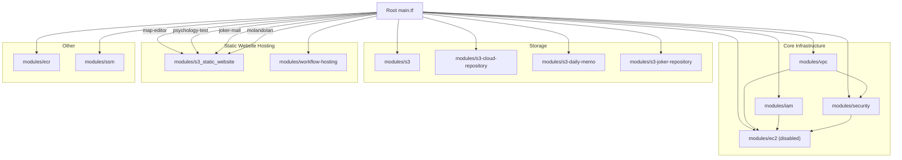
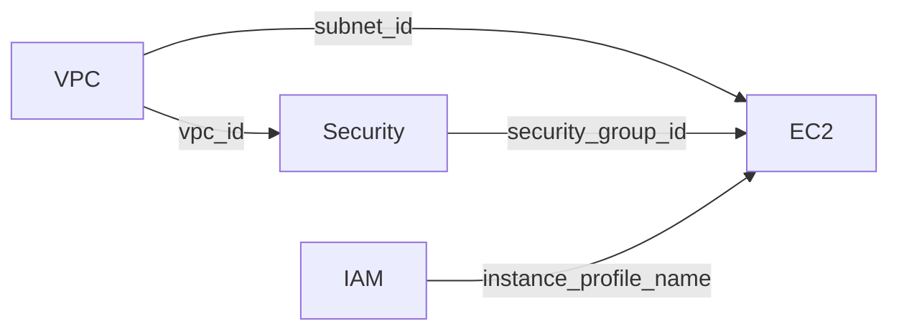

# Terraform AWS 인프라 아키텍처 리뷰

> 작성일: 2026-02-24
> 대상: terraform_app 전체 코드베이스 (14개 모듈)

---

## 1. 현재 아키텍처 요약

### 모듈 구성도



### 모듈별 의존 관계



### 리소스 목록

| 모듈 | 주요 리소스 | 상태 |
|------|------------|------|
| vpc | Default VPC, 3x Default Subnet | Active |
| iam | IAM Role, Policy, Instance Profile | Active (EC2 비활성이지만 리소스 존재) |
| security | Security Group | Active (EC2 비활성이지만 리소스 존재) |
| ec2 | EC2 Instance, Elastic IP | **Disabled** (`enabled = false`) |
| ecr | ECR Repository (dev_frog) | Active |
| ssm | 11x SSM Parameters (Redis, MySQL, RabbitMQ) | Active |
| s3 | board-game-app 버킷 + terraform-backend 버킷 | Active |
| s3-cloud-repository | cloudbox-app 버킷 (정적 웹 호스팅) | Active |
| s3-daily-memo | daily-memo-dev 버킷 | Active |
| s3-joker-repository | joker-cloud-repository-dev 버킷 | Active |
| s3_static_website | 4개 사이트 (map-editor, psychology-test, joker-mall, molandolan) | Active |
| workflow-hosting | jokertrickster-workflow 버킷 | Active |

---

## 2. Critical 이슈 (즉시 수정 필요)

### 2.1 보안그룹 전체 개방

**파일**: `modules/security/main.tf`

현재 첫 번째 ingress 규칙이 모든 포트, 모든 프로토콜을 `0.0.0.0/0`으로 허용하고 있어 그 아래의 SSH/HTTP/HTTPS 규칙이 완전히 무의미합니다.

```hcl
# 현재 코드 - 문제
ingress {
  description = "Allow all inbound traffic"
  from_port   = 0
  to_port     = 0
  protocol    = "-1"          # 모든 프로토콜
  cidr_blocks = ["0.0.0.0/0"] # 전체 IP
}
```

**권장 수정**: 전체 개방 규칙을 제거하고, 필요한 포트만 명시적으로 허용해야 합니다. SSH는 특정 IP로 제한하는 것을 권장합니다.

```hcl
# 권장
ingress {
  description = "SSH"
  from_port   = 22
  to_port     = 22
  protocol    = "tcp"
  cidr_blocks = ["<관리자_IP>/32"]
}

ingress {
  description = "HTTP"
  from_port   = 80
  to_port     = 80
  protocol    = "tcp"
  cidr_blocks = ["0.0.0.0/0"]
}

ingress {
  description = "HTTPS"
  from_port   = 443
  to_port     = 443
  protocol    = "tcp"
  cidr_blocks = ["0.0.0.0/0"]
}
```

### 2.2 user_data.sh 평문 패스워드

**파일**: `modules/ec2/user_data.sh`

Docker Compose 파일 안에 데이터베이스 비밀번호가 평문으로 하드코딩되어 있습니다.

```yaml
# 현재 코드 - 문제
MYSQL_ROOT_PASSWORD: examplepassword
MYSQL_PASSWORD: examplepassword
RABBITMQ_DEFAULT_PASS: examplepassword
command: redis-server --requirepass examplepassword
```

**권장 수정**: SSM Parameter Store에서 비밀번호를 가져와 환경변수로 주입해야 합니다.

```bash
# user_data.sh에서 SSM에서 비밀번호 가져오기
MYSQL_PASSWORD=$(aws ssm get-parameter --name "dev_frog_mysql_password" --with-decryption --query 'Parameter.Value' --output text --region ap-south-1)
REDIS_PASSWORD=$(aws ssm get-parameter --name "dev_frog_redis_password" --with-decryption --query 'Parameter.Value' --output text --region ap-south-1)
```

### 2.3 IAM 과도한 권한

**파일**: `modules/iam/main.tf`

EC2 역할에 `ec2:*`와 `s3:*` 와일드카드 권한이 부여되어 있어 최소 권한 원칙(Principle of Least Privilege)을 위반합니다.

```hcl
# 현재 코드 - 문제
Action = [
  "ec2:*",   # EC2 모든 작업 허용
]
Resource = "*"

Action = [
  "s3:*"     # S3 모든 작업 허용
]
```

**권장 수정**: 실제로 필요한 Action만 명시적으로 나열해야 합니다.

```hcl
# 권장 - 필요한 권한만 명시
Action = [
  "ec2:DescribeInstances",
  "ec2:DescribeTags",
]

Action = [
  "s3:GetObject",
  "s3:PutObject",
  "s3:ListBucket",
]
```

---

## 3. High 이슈 (코드 품질)

### 3.1 S3 모듈 코드 중복

현재 S3 관련 모듈이 5개 존재하며, 대부분 동일한 패턴(버킷 생성, 버전관리, 암호화, 공개 액세스 설정)을 반복합니다.

| 모듈 | 용도 | 중복 수준 |
|------|------|----------|
| `s3` | 앱 버킷 + 백엔드 버킷 | 고유 |
| `s3-cloud-repository` | 정적 웹 호스팅 + IAM | `s3_static_website`와 **거의 동일** |
| `s3-daily-memo` | 공개 읽기 버킷 | 부분 중복 |
| `s3-joker-repository` | Presigned URL 스토리지 | 고유 (lifecycle 있음) |
| `s3_static_website` | 정적 웹 호스팅 + IAM | 범용 재사용 모듈 |

`s3-cloud-repository`는 `s3_static_website` 모듈로 완전히 대체 가능합니다. `s3-daily-memo`도 약간의 변수 추가로 통합 가능합니다.

### 3.2 모듈 내 provider 선언

**해당 파일**:
- `modules/vpc/main.tf` (line 66)
- `modules/iam/main.tf` (line 100)
- `modules/ecr/main.tf` (line 60)

자식 모듈에서 provider를 직접 선언하는 것은 Terraform 안티패턴입니다. provider는 루트 모듈에서만 선언하고 자식 모듈은 상속받아야 합니다. 모듈 내 provider 선언은 provider 설정 충돌과 예기치 않은 동작을 유발할 수 있습니다.

```hcl
# 삭제해야 할 코드 (각 모듈에서)
provider "aws" {
  region = "ap-south-1"
}
```

### 3.3 하드코딩된 값

| 위치 | 하드코딩 값 | 권장 |
|------|-----------|------|
| `modules/ec2/main.tf:5` | AMI ID `ami-02f607855bfce66b6` | data source로 최신 AMI 조회 |
| `modules/ec2/user_data.sh` | AWS 계정 ID `298483610289` | SSM 또는 변수로 전달 |
| `modules/ecr/main.tf:3` | 리포지토리명 `dev_frog` | 변수로 전달 |
| `modules/s3/main.tf:14` | 백엔드 버킷명 | 변수로 전달 |

AMI ID의 경우 data source를 사용하면 리전이나 아키텍처 변경 시 자동으로 대응됩니다.

```hcl
data "aws_ami" "amazon_linux" {
  most_recent = true
  owners      = ["amazon"]

  filter {
    name   = "name"
    values = ["al2023-ami-*-arm64"]
  }
}
```

### 3.4 State Locking 미설정

현재 S3 백엔드만 사용하고 DynamoDB 테이블이 없어, 동시에 `terraform apply`를 실행하면 state 파일이 손상될 수 있습니다.

```hcl
# 현재 - locking 없음
backend "s3" {
  bucket = "board-game-app-terraform-backend-dev"
  key    = "terraform.tfstate"
  region = "ap-south-1"
}
```

```hcl
# 권장 - DynamoDB locking 추가
backend "s3" {
  bucket         = "board-game-app-terraform-backend-dev"
  key            = "terraform.tfstate"
  region         = "ap-south-1"
  dynamodb_table = "terraform-state-lock"
  encrypt        = true
}
```

---

## 4. Medium 이슈 (일관성/유지보수)

### 4.1 미사용 변수

`vpc_cidr`와 `public_subnet_cidr`가 루트 `variables.tf`에 선언되고 VPC 모듈에 전달되지만, VPC 모듈은 `aws_default_vpc`를 사용하므로 이 변수들은 어디에서도 참조되지 않습니다.

### 4.2 네이밍 불일치

모듈 디렉토리명이 하이픈과 언더스코어를 혼용합니다.

```
modules/s3-cloud-repository/   # 하이픈
modules/s3-daily-memo/         # 하이픈
modules/s3-joker-repository/   # 하이픈
modules/s3_static_website/     # 언더스코어
modules/workflow-hosting/      # 하이픈
```

하나의 규칙으로 통일해야 합니다. Terraform 커뮤니티 컨벤션은 하이픈(`-`)을 권장합니다.

### 4.3 README 불일치

`modules/workflow-hosting/README.md`가 CloudFront 리소스와 관련 outputs를 설명하지만, 실제 코드에서는 CloudFront가 제거된 상태입니다. README를 현재 구현에 맞게 업데이트해야 합니다.

### 4.4 비활성 리소스

EC2가 `enabled = false`로 비활성화되어 있지만, IAM 역할(`board_game_app-ec2-role`), IAM 정책, Instance Profile, 보안그룹은 계속 생성/유지됩니다. 불필요한 리소스입니다.

---

## 5. 개선 제안 (로드맵)

### Phase 1: 보안 (즉시)

- [ ] 보안그룹에서 전체 개방 ingress 규칙 제거
- [ ] user_data.sh에서 평문 패스워드 제거, SSM으로 대체
- [ ] IAM 정책에서 와일드카드 권한 축소

### Phase 2: 코드 정리 (단기)

- [ ] 모듈 내 provider 선언 3곳 제거
- [ ] `s3-cloud-repository` 모듈을 `s3_static_website`로 마이그레이션
- [ ] 미사용 변수(`vpc_cidr`, `public_subnet_cidr`) 정리
- [ ] ECR 리포지토리명을 변수로 변경
- [ ] AMI ID를 data source로 변경
- [ ] workflow-hosting README 업데이트

### Phase 3: 안정성 (중기)

- [ ] DynamoDB 테이블 생성 후 state locking 활성화
- [ ] 모듈 디렉토리 네이밍 통일 (하이픈 또는 언더스코어)
- [ ] 태그 전략 표준화 (공통 태그 변수 `local.common_tags` 도입)
- [ ] EC2 비활성 시 IAM/보안그룹도 조건부 생성으로 변경

### Phase 4: 확장성 (장기)

- [ ] 환경 분리 전략 수립 (Terraform Workspaces 또는 디렉토리 기반)
- [ ] S3 모듈을 유형별로 통합 (private-storage, static-website, backend 3종으로)
- [ ] CI/CD 파이프라인에 `terraform plan` 자동 실행 추가
- [ ] Terraform 모듈 버전 관리 도입 (Git 태그 기반)
