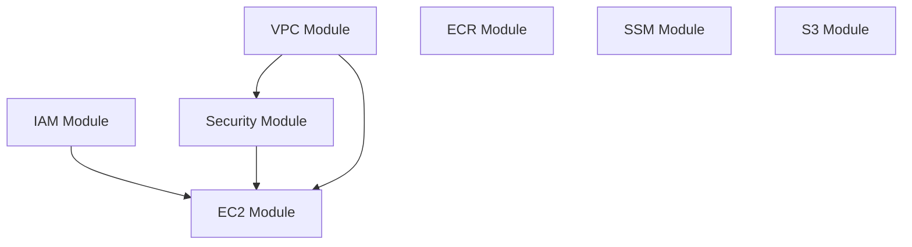

# Terraform AWS Infrastructure - Board Game App

Modular Terraform infrastructure for a board game application on AWS. Manages VPC, EC2, ECR, S3, SSM parameters, IAM roles, and security groups in the ap-south-1 (Mumbai) region.

## 🏗️ Architecture Overview

This project uses a **modular architecture** where the root configuration orchestrates 7 specialized modules:

```
┌─────────────────────────────────────────────────────────┐
│                    AWS ap-south-1                       │
│  ┌──────────────────────────────────────────────────┐  │
│  │  Default VPC (172.31.0.0/16)                     │  │
│  │  ┌────────────────────────────────────────────┐  │  │
│  │  │  Subnets (ap-south-1a/b/c)                 │  │  │
│  │  │  ┌──────────────────────────────────────┐  │  │  │
│  │  │  │  EC2 Instance (t4g.medium)           │  │  │  │
│  │  │  │  - Amazon Linux 2023 (ARM64)        │  │  │  │
│  │  │  │  - 30GB gp3 encrypted volume        │  │  │  │
│  │  │  │  - Elastic IP attached              │  │  │  │
│  │  │  │  - IAM Instance Profile             │  │  │  │
│  │  │  └──────────────────────────────────────┘  │  │  │
│  │  └────────────────────────────────────────────┘  │  │
│  └──────────────────────────────────────────────────┘  │
│                                                         │
│  ┌─────────────┐  ┌──────────────┐  ┌──────────────┐  │
│  │ ECR Repo    │  │ S3 Buckets   │  │ SSM Params   │  │
│  │ (Docker)    │  │ (Storage)    │  │ (Secrets)    │  │
│  └─────────────┘  └──────────────┘  └──────────────┘  │
└─────────────────────────────────────────────────────────┘
```

## 📁 Project Structure

```
terraform_app/
├── main.tf              # Root module orchestration
├── variables.tf         # Input variables
├── outputs.tf          # Output values
├── providers.tf        # AWS provider & S3 backend config
├── modules/
│   ├── vpc/            # Default VPC & subnet management
│   │   ├── main.tf
│   │   ├── variables.tf
│   │   └── outputs.tf
│   ├── security/       # Security groups (SSH, HTTP, HTTPS)
│   │   ├── main.tf
│   │   ├── variables.tf
│   │   └── outputs.tf
│   ├── ec2/            # EC2 instance with user data
│   │   ├── main.tf
│   │   ├── variables.tf
│   │   ├── outputs.tf
│   │   └── user_data.sh
│   ├── iam/            # IAM role with EC2/ECR/S3/SSM permissions
│   │   ├── main.tf
│   │   ├── variables.tf
│   │   └── outputs.tf
│   ├── ecr/            # Docker image repository
│   │   ├── main.tf
│   │   ├── variables.tf
│   │   └── outputs.tf
│   ├── ssm/            # Parameter store for configs
│   │   ├── main.tf
│   │   ├── variables.tf
│   │   └── outputs.tf
│   └── s3/             # Application & backend buckets
│       ├── main.tf
│       ├── variables.tf
│       └── outputs.tf
└── README.md
```

## 📦 Module Details

### VPC Module (`modules/vpc/`)
**Purpose**: Leverages AWS default VPC infrastructure

- **Default VPC**: 172.31.0.0/16 CIDR block
- **Subnets**: Default subnets in ap-south-1a, ap-south-1b, ap-south-1c
- **Internet Gateway**: Pre-configured default IGW
- **Route Tables**: Default routing to internet

**Outputs**: `vpc_id`, `subnet_ids`, `internet_gateway_id`, `route_table_id`

### Security Module (`modules/security/`)
**Purpose**: Network access control for EC2 instances

- **Ingress Rules**:
  - SSH (22): 0.0.0.0/0
  - HTTP (80): 0.0.0.0/0
  - HTTPS (443): 0.0.0.0/0
- **Egress Rules**: All traffic allowed

**Outputs**: `security_group_id`

⚠️ **Security Note**: Production environments should restrict SSH to specific IP ranges

### EC2 Module (`modules/ec2/`)
**Purpose**: Application server instance

- **AMI**: ami-02f607855bfce66b6 (Amazon Linux 2023 ARM64)
- **Instance Type**: t4g.medium (ARM-based Graviton2)
- **Storage**: 30GB gp3 encrypted root volume
- **Network**: Elastic IP for consistent public addressing
- **IAM**: Instance profile attached for AWS service access
- **Bootstrap**: User data script (`user_data.sh`) for initial setup

**Outputs**: `instance_id`, `public_ip`, `public_dns`

### IAM Module (`modules/iam/`)
**Purpose**: EC2 service permissions

**Permissions Granted**:
- **EC2**: Full access (`ec2:*`)
- **ECR**: Pull/push Docker images
- **SSM**: Read parameters (`ssm:GetParameter*`)
- **S3**: Full access to `board-game-app` bucket

**Outputs**: `ec2_role_arn`, `ec2_instance_profile_name`

### ECR Module (`modules/ecr/`)
**Purpose**: Docker image repository

- **Repository Name**: `{project_name}-ecr`
- **Image Scanning**: Configurable
- **Lifecycle Policy**: Manageable retention

**Outputs**: `repository_url`, `repository_name`, `repository_arn`

### SSM Module (`modules/ssm/`)
**Purpose**: Secure parameter storage

**Parameters Stored** (SecureString):
- **Redis**: User, host, port, database
- **MySQL**: User, host, port, database name
- **RabbitMQ**: User, host, port

**Outputs**: Parameter ARNs for each service

### S3 Module (`modules/s3/`)
**Purpose**: Object storage and Terraform state backend

**Application Bucket** (`board-game-app`):
- Folder structure for game assets:
  - `profiles/`, `cards/`
  - `frog/images/`, `find-it/images/`, `board_game/images/`
  - `wingspan/missions/`, `wingspan/images/`
  - `slime_war/images/`
- Server-side encryption (AES256)
- Versioning enabled
- Public access blocked

**Backend Bucket** (`board-game-app-terraform-backend-{env}`):
- Stores Terraform state file
- Versioning enabled for state history
- Encryption enabled
- Public access blocked

**Outputs**: `bucket_id`, `bucket_arn`, `bucket_name`, `backend_bucket_name`

## 🚀 Quick Start

### Prerequisites

1. **AWS Account** with appropriate permissions
2. **AWS CLI** configured with credentials:
   ```bash
   aws configure
   ```
3. **SSH Key Pair** created in AWS ap-south-1 region:
   - Key name: `logan.cho.home` (or modify `var.key_name` in `variables.tf`)
   - Download and store the `.pem` file securely

4. **Terraform** installed (>= 1.0):
   ```bash
   terraform version
   ```

### Initial Setup

1. **Clone the repository**:
   ```bash
   git clone https://github.com/JokerTrickster/terraform_app
   cd terraform_app
   ```

2. **Initialize Terraform**:
   ```bash
   terraform init
   ```
   This will:
   - Download AWS provider (~6.0)
   - Configure S3 backend connection
   - Initialize modules

3. **Configure sensitive variables** (optional):
   Create `terraform.tfvars` (never commit this file):
   ```hcl
   dev_frog_redis_user     = "your_redis_user"
   dev_frog_mysql_user     = "your_mysql_user"
   dev_frog_rabbitmq_user  = "your_rabbitmq_user"
   ```

### Deployment

1. **Validate configuration**:
   ```bash
   terraform validate
   terraform fmt -check
   ```

2. **Preview changes**:
   ```bash
   terraform plan
   ```
   Review the output to understand what will be created

3. **Apply infrastructure**:
   ```bash
   terraform apply
   ```
   Type `yes` to confirm

4. **View outputs**:
   ```bash
   terraform output
   ```

### Post-Deployment

**Connect to EC2 instance**:
```bash
# Get public IP
EC2_IP=$(terraform output -raw ec2_public_ip)

# SSH connection
ssh -i ~/.ssh/logan.cho.home.pem ec2-user@$EC2_IP
```

**Docker operations (on EC2)**:
```bash
# Login to ECR
aws ecr get-login-password --region ap-south-1 | \
  docker login --username AWS --password-stdin \
  $(terraform output -raw ecr_repository_url)

# Pull/push images
docker pull $(terraform output -raw ecr_repository_url):latest
docker push $(terraform output -raw ecr_repository_url):latest
```

### Cleanup

**Destroy infrastructure** (to avoid costs):
```bash
terraform destroy
```
⚠️ **Warning**: This will delete all resources including S3 buckets and data

## 📊 Outputs Reference

| Output | Description | Example Value |
|--------|-------------|---------------|
| `vpc_id` | Default VPC ID | vpc-abc12345 |
| `vpc_cidr_block` | VPC CIDR range | 172.31.0.0/16 |
| `subnet_ids` | List of subnet IDs | [subnet-xyz, ...] |
| `internet_gateway_id` | IGW identifier | igw-def67890 |
| `route_table_id` | Main route table ID | rtb-ghi34567 |
| `ec2_instance_id` | EC2 instance ID | i-0abcd1234efgh5678 |
| `ec2_public_ip` | Elastic IP address | 13.126.45.67 |
| `ec2_public_dns` | Public DNS name | ec2-13-126-45-67... |
| `ecr_repository_url` | Docker repository URL | 123456789.dkr.ecr... |
| `ecr_repository_name` | ECR repo name | board_game_app-ecr |
| `ecr_repository_arn` | ECR ARN | arn:aws:ecr:... |
| `s3_bucket_id` | Application bucket ID | board-game-app |
| `s3_bucket_arn` | Application bucket ARN | arn:aws:s3:... |
| `s3_bucket_name` | Application bucket name | board-game-app |
| `backend_bucket_name` | State backend bucket | board-game-app-terraform-backend-dev |

## 🔧 Module Dependencies



**Dependency Chain**:
1. VPC creates network foundation
2. IAM creates EC2 instance profile
3. Security creates security group (depends on VPC)
4. EC2 launches instance (depends on VPC, IAM, Security)
5. ECR, SSM, S3 are independent modules

## 💰 Cost Considerations

**Monthly Cost Estimate** (ap-south-1 region):

| Resource | Type | Estimated Cost (USD) |
|----------|------|---------------------|
| EC2 Instance | t4g.medium (on-demand) | ~$30-35/month |
| EBS Volume | 30GB gp3 | ~$2.40/month |
| Elastic IP | (while attached) | Free |
| S3 Storage | First 50TB | $0.025/GB |
| ECR Storage | First 50GB | Free (then $0.10/GB) |
| Data Transfer | Outbound to internet | $0.09/GB |
| VPC, IGW, Security Groups | N/A | Free |

**Total**: ~$35-40/month (excluding data transfer and S3 storage)

**Cost Optimization Tips**:
- Use `t4g.small` instead of `t4g.medium` for dev environments
- Stop EC2 instances when not in use
- Enable S3 lifecycle policies for old objects
- Use Reserved Instances for production workloads

## ⚙️ Configuration Management

### Environment Variables

**Method 1: terraform.tfvars** (recommended for team settings):
```hcl
# terraform.tfvars (add to .gitignore)
environment  = "dev"
project_name = "board_game_app"
instance_type = "t4g.medium"

# Sensitive parameters
dev_frog_redis_user    = "production_user"
dev_frog_mysql_user    = "production_user"
dev_frog_rabbitmq_user = "production_user"
```

**Method 2: Environment variables** (recommended for CI/CD):
```bash
export TF_VAR_environment="dev"
export TF_VAR_dev_frog_redis_user="redis_user"
export TF_VAR_dev_frog_mysql_user="mysql_user"
```

**Method 3: CLI arguments**:
```bash
terraform apply -var="environment=staging" -var="instance_type=t4g.small"
```

### Multi-Environment Strategy

Create environment-specific variable files:

```bash
# Development
terraform apply -var-file="environments/dev.tfvars"

# Staging
terraform apply -var-file="environments/staging.tfvars"

# Production
terraform apply -var-file="environments/prod.tfvars"
```

Example `environments/dev.tfvars`:
```hcl
environment   = "dev"
instance_type = "t4g.small"
```

## 🔒 Security Best Practices

### Current Security Measures
✅ **Implemented**:
- EBS encryption enabled
- S3 bucket versioning
- S3 server-side encryption (AES256)
- S3 public access blocked
- IAM instance profile (no hardcoded credentials)
- SSM Parameter Store for secrets (SecureString type)

⚠️ **Production Recommendations**:

1. **Restrict SSH access**:
   ```hcl
   # In modules/security/main.tf
   ingress {
     from_port   = 22
     to_port     = 22
     protocol    = "tcp"
     cidr_blocks = ["YOUR_OFFICE_IP/32"]  # Instead of 0.0.0.0/0
   }
   ```

2. **Enable AWS CloudTrail** for audit logging

3. **Use AWS Secrets Manager** instead of SSM for sensitive data

4. **Enable VPC Flow Logs** for network monitoring

5. **Implement least privilege IAM**:
   - Replace `ec2:*` with specific permissions
   - Scope S3 permissions to specific buckets

## 🐛 Troubleshooting

### Common Issues

**Issue 1: Backend bucket doesn't exist**
```bash
Error: Failed to get existing workspaces: S3 bucket does not exist
```
**Solution**: Create backend bucket first or disable backend temporarily:
```bash
# Comment out backend block in providers.tf
terraform init
terraform apply -target=module.s3  # Create buckets
# Uncomment backend block
terraform init -migrate-state
```

**Issue 2: SSH key not found**
```bash
Error: InvalidKeyPair.NotFound
```
**Solution**: Create key pair in AWS Console or via CLI:
```bash
aws ec2 create-key-pair \
  --key-name logan.cho.home \
  --region ap-south-1 \
  --query 'KeyMaterial' \
  --output text > logan.cho.home.pem
chmod 400 logan.cho.home.pem
```

**Issue 3: AMI not found**
```bash
Error: InvalidAMIID.NotFound
```
**Solution**: AMI IDs are region-specific. Update `modules/ec2/main.tf` with correct AMI:
```bash
# Find latest Amazon Linux 2023 ARM64 AMI
aws ec2 describe-images \
  --owners amazon \
  --filters "Name=name,Values=al2023-ami-*-arm64" \
  --query 'Images | sort_by(@, &CreationDate) | [-1].ImageId' \
  --region ap-south-1
```

**Issue 4: State lock timeout**
```bash
Error: Error locking state: ConditionalCheckFailedException
```
**Solution**: Wait for lock to release or force unlock (use carefully):
```bash
terraform force-unlock <LOCK_ID>
```

### Debugging Commands

**Enable verbose logging**:
```bash
export TF_LOG=DEBUG
export TF_LOG_PATH=terraform-debug.log
terraform apply
```

**Inspect state**:
```bash
# List all resources
terraform state list

# Show specific resource
terraform state show module.ec2.aws_instance.main

# Pull remote state
terraform state pull > state-backup.json
```

**Validate module configuration**:
```bash
# Check syntax
terraform validate

# Format code
terraform fmt -recursive

# View dependency graph
terraform graph | dot -Tsvg > graph.svg
```

## 📈 Monitoring & Operations

### Essential AWS CLI Commands

**EC2 Operations**:
```bash
# Get instance details
aws ec2 describe-instances \
  --filters "Name=tag:Name,Values=board_game_app-ec2" \
  --region ap-south-1

# Get instance console output
aws ec2 get-console-output \
  --instance-id $(terraform output -raw ec2_instance_id) \
  --region ap-south-1

# Stop/start instance
aws ec2 stop-instances --instance-ids i-xxxxx
aws ec2 start-instances --instance-ids i-xxxxx
```

**S3 Operations**:
```bash
# List bucket contents
aws s3 ls s3://board-game-app/ --recursive

# Upload file
aws s3 cp local-file.jpg s3://board-game-app/profiles/

# Sync directory
aws s3 sync ./assets s3://board-game-app/wingspan/images/
```

**ECR Operations**:
```bash
# List images
aws ecr list-images \
  --repository-name board_game_app-ecr \
  --region ap-south-1

# Delete image
aws ecr batch-delete-image \
  --repository-name board_game_app-ecr \
  --image-ids imageTag=v1.0.0
```

**SSM Operations**:
```bash
# Get parameter
aws ssm get-parameter \
  --name /board_game_app/dev/frog/redis/user \
  --with-decryption \
  --region ap-south-1

# Update parameter
aws ssm put-parameter \
  --name /board_game_app/dev/frog/redis/user \
  --value "new_value" \
  --type SecureString \
  --overwrite
```

### CloudWatch Monitoring

**View EC2 metrics**:
```bash
# CPU utilization
aws cloudwatch get-metric-statistics \
  --namespace AWS/EC2 \
  --metric-name CPUUtilization \
  --dimensions Name=InstanceId,Value=$(terraform output -raw ec2_instance_id) \
  --start-time $(date -u -d '1 hour ago' +%Y-%m-%dT%H:%M:%S) \
  --end-time $(date -u +%Y-%m-%dT%H:%M:%S) \
  --period 300 \
  --statistics Average
```

## 🚀 Advanced Usage

### Terraform Workspaces (Multi-Environment)

```bash
# Create workspaces for each environment
terraform workspace new dev
terraform workspace new staging
terraform workspace new prod

# Switch workspace
terraform workspace select dev

# Apply configuration
terraform apply
```

### Targeted Operations

```bash
# Apply only specific module
terraform apply -target=module.ec2

# Destroy only specific resource
terraform destroy -target=module.ec2.aws_instance.main

# Refresh specific resource
terraform refresh -target=module.vpc
```

### State Management

```bash
# Import existing resource
terraform import module.ec2.aws_instance.main i-1234567890abcdef

# Remove resource from state (doesn't delete actual resource)
terraform state rm module.ec2.aws_instance.main

# Move resource in state
terraform state mv module.ec2 module.ec2_new
```

## 📚 Additional Resources

### Official Documentation
- [Terraform AWS Provider](https://registry.terraform.io/providers/hashicorp/aws/latest/docs)
- [Terraform Best Practices](https://www.terraform.io/docs/cloud/guides/recommended-practices)
- [AWS Well-Architected Framework](https://aws.amazon.com/architecture/well-architected)

### Useful Tools
- [Terraform Lint (tflint)](https://github.com/terraform-linters/tflint) - Static analysis
- [Checkov](https://www.checkov.io/) - Security scanning
- [Terragrunt](https://terragrunt.gruntwork.io/) - DRY Terraform configurations
- [Infracost](https://www.infracost.io/) - Cost estimation

### Learning Resources
- [HashiCorp Learn](https://learn.hashicorp.com/terraform)
- [AWS Training](https://aws.amazon.com/training/)

## 🤝 Contributing

Contributions are welcome! Please follow these guidelines:

1. **Fork the repository**
2. **Create a feature branch**:
   ```bash
   git checkout -b feature/amazing-feature
   ```
3. **Make changes and test**:
   ```bash
   terraform fmt -recursive
   terraform validate
   terraform plan
   ```
4. **Commit with meaningful message**:
   ```bash
   git commit -m "feat: add auto-scaling group module"
   ```
5. **Push to your fork**:
   ```bash
   git push origin feature/amazing-feature
   ```
6. **Open a Pull Request**

### Commit Message Convention
- `feat:` New feature
- `fix:` Bug fix
- `docs:` Documentation changes
- `refactor:` Code refactoring
- `test:` Test additions/modifications

## 📄 License

This project is licensed under the MIT License - see the LICENSE file for details.

## ⚠️ Important Notes

1. **Region**: ap-south-1 (Mumbai) - change in `providers.tf` if needed
2. **SSH Key**: Must exist in AWS before applying (`logan.cho.home`)
3. **Backend**: Remote state stored in S3 - coordinate team changes
4. **Costs**: Monitor AWS billing dashboard regularly
5. **Security**: Tighten security group rules for production
6. **State File**: Never manually edit `terraform.tfstate`

## 📞 Support

- **GitHub Issues**: [Report bugs or request features](https://github.com/JokerTrickster/terraform_app/issues)
- **AWS Support**: Check your AWS support plan
- **Terraform Community**: [HashiCorp Discuss](https://discuss.hashicorp.com/c/terraform-core)  